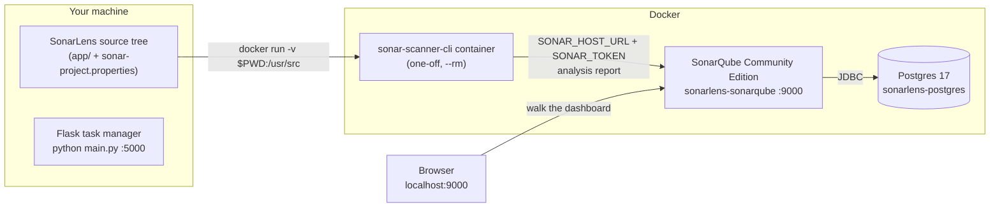
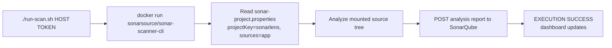
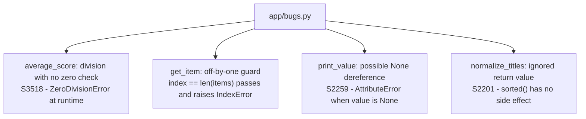
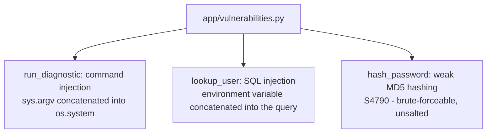
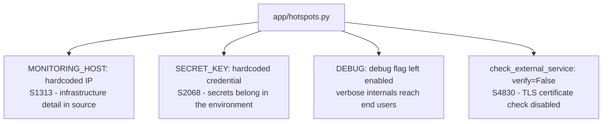
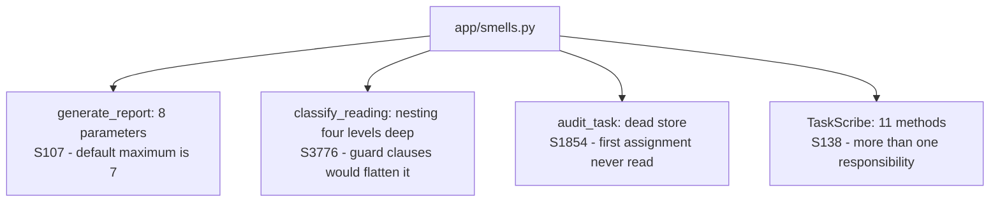
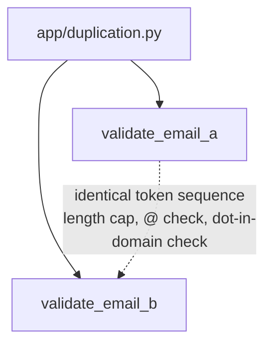
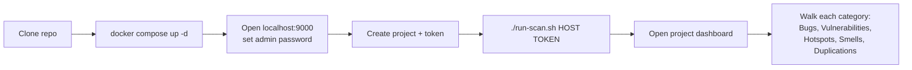

# SonarLens

[](LICENSE)

> 📋 **Looking for step-by-step setup instructions?** See [demo.md](demo.md).

## Authors

| Name | GitHub |
|---|---|
| Siddhant Shukla | [@Siddhantshukla1657](https://github.com/Siddhantshukla1657) |
| Shubhpreet Kaur | [@ShubhpreetKDhariwal](https://github.com/ShubhpreetKDhariwal) |

---

SonarLens is a small, deliberately flawed Flask task manager built to showcase every major issue category that SonarQube detects: Bugs, Vulnerabilities, Security Hotspots, Code Smells, and Duplications. The analysis stack is self-hosted SonarQube Community Edition, so the entire demo runs offline through Docker with no SonarCloud account or external service.

The application itself is intentionally minimal. The point of interest is the seeded issues, and each SonarQube category lives in its own clearly labeled file so a dashboard finding can always be traced back to one specific place.

Everything under `app/` that looks dangerous is demo-only and intentional. The vulnerable functions are never wired to any endpoint, and the app binds to localhost only. Do not reuse this code anywhere real.

## How it fits together

Two halves run side by side: the demo app you can execute locally, and the analysis stack in Docker. The scanner never touches your local Python; it reads the source tree from a read-only mount and pushes findings to the server over HTTP.



The demo app and the analysis stack are independent: the app runs with or without Docker, and the scan reads source files only, so nothing needs to be running for the scan to work.

## What you need

- Docker Engine and Docker Compose
- Python 3.12 (only if you want to run the app itself outside Docker)

## Step 1: Start the SonarQube server

Copy `.env.example` to `.env` and set a local database password before starting:

```bash
cp .env.example .env
```

The `.env` file is ignored by Git. Compose uses its `POSTGRES_*` values for
both SonarQube and Postgres, so the credentials stay consistent across the
two containers.

```bash
docker compose up -d
```

This starts two containers: Postgres 17 (the backing database) and SonarQube Community Edition, which serves the web UI at `http://localhost:9000`.

The first startup takes roughly a minute, sometimes longer, while SonarQube initializes its database and indexes. Watch it come up with:

```bash
docker compose logs -f sonarqube
```

The server is ready when the log shows `SonarQube is operational` or `http://localhost:9000` starts returning the login page.

## Step 2: Log in and create a project token

1. Open `http://localhost:9000` and log in with `admin` / `admin`.
2. Set a new password when prompted. Change it from the default even for a local-only demo.
3. From the Projects view, choose Add project, then Manually.
4. Set the project display name to `SonarLens` and the project key to `Sonarlens` (must match `sonar-project.properties`).
5. On the token screen, generate a token and copy it. You will pass it to the scanner in the next step. You can close the CI setup page the wizard offers afterwards.

## Step 3: Run the scan

Add the token and host URL to `.env`:

```dotenv
SONAR_HOST_URL=http://host.docker.internal:9000
SONAR_TOKEN=<your-token>
```

Then run the scanner without exposing the token in the shell command:

```bash
./run-scan.sh
```

On Windows, use the batch script or PowerShell:

```cmd
run-scan.bat
```

```powershell
./run-scan.ps1
```

The scripts also accept `[SONAR_HOST_URL] [SONAR_TOKEN]` arguments, which
override the values loaded from `.env`.

Under the hood this is one `docker run` of the official scanner image:



The host URL depends on your Docker setup, because the scanner runs in its own container and must reach the SonarQube server over the network:

| Environment | SONAR_HOST_URL |
|---|---|
| Docker Desktop (macOS, Windows) | `http://host.docker.internal:9000` |
| Linux with default Docker bridge | `http://172.17.0.1:9000` |
| Linux, scanner attached to the compose network | `http://sonarlens-sonarqube:9000` |

For the third option, add `--network sonarlens_default` to the `docker run` call inside `run-scan.sh`, or run the raw command yourself:

```bash
docker run --rm \
  --network sonarlens_default \
  -e SONAR_HOST_URL="http://sonarlens-sonarqube:9000" \
  -e SONAR_TOKEN="<your-token>" \
  -v "$PWD:/usr/src" \
  sonarsource/sonar-scanner-cli
```

A successful run ends with `EXECUTION SUCCESS` and a link to the dashboard. An invalid or expired token fails fast with an authentication error; if the scanner cannot reach the server, the run fails with a connection error and no partial state is committed to the dashboard.

## Step 4: Walk the dashboard

Open the project dashboard at `http://localhost:9000/dashboard?id=Sonarlens`. After the first scan, all five categories show findings. The mapping below is the core of the walkthrough: one seed file per category, one short explanation per issue.

| Seed file | SonarQube category | What it demonstrates |
|---|---|---|
| `app/bugs.py` | Bugs | Division by zero (S3518), off-by-one boundary in `get_item`, possible None dereference in `print_value` (S2259), ignored return value of `sorted()` (S2201), unreachable code (S1763), self-assignment (S1656), return in finally block (S1143) |
| `app/vulnerabilities.py` | Vulnerabilities | OS command injection, SQL string concatenation, weak MD5/SHA-1 hashing (S4790), hardcoded credentials (S2068), insecure PRNG for security tokens (S2245), world-writable file permissions (S2612), cleartext protocols (S5332) |
| `app/hotspots.py` | Security Hotspots | Hardcoded credentials (S2068), debug flag left enabled (S4507), TLS certificate verification disabled (S4830) |
| `app/smells.py` | Code Smells | Mergeable nested ifs (S1066), dead store (S1854), unused local variables (S1481), unused parameters (S1172), tracked TODO (S1135) and FIXME (S1134) tags, unused private class methods (S1144) |
| `app/duplication.py` | Duplications | Two full customer account validation pipelines exceeding SonarQube's 100-token CPD threshold |

Note on classifications: SonarQube assigns rules to categories statically. In recent versions of SonarQube (such as 26.9+), security-relevant rules like MD5 hashing, CSRF protection, and certificate verification are grouped under Vulnerabilities with the `former-hotspot` tag. The demo showcases both confirmed logic flaws and security-sensitive review points.

### What to point at, category by category

**Bugs (`app/bugs.py`)** are correctness defects: they break the program at runtime.



The `get_item` bug is live: `GET /tasks/<idx>` with the index one past the last task returns HTTP 500 (see "Run the demo app itself" below).

**Vulnerabilities (`app/vulnerabilities.py`)** are exploitable flaws confirmed by the analyzer. None of these functions are called at runtime; they exist to be found by the scan.



**Security Hotspots (`app/hotspots.py`)** are security-sensitive constructs that need a human review decision, not automatic failures.



**Code Smells (`app/smells.py`)** hurt maintainability, not correctness.



**Duplications (`app/duplication.py`)** is a metric, not a rule: SonarQube compares token sequences (default threshold 10 tokens) and highlights the shared block between `validate_email_a` and `validate_email_b`. Renaming variables would not hide it, because duplication is measured on tokens, not names.



## Run the demo app itself

The task manager is what the scanner analyzes, and it is a real runnable application:

```bash
python -m venv .venv
source .venv/bin/activate
pip install -r app/requirements.txt
cd app && python main.py
```

Endpoints (all on `127.0.0.1:5000`):

| Method | Endpoint | Purpose |
|---|---|---|
| GET | `/health` | Liveness check; also reports the seeded debug flag |
| GET | `/tasks` | List all tasks |
| POST | `/tasks` | Add a task; JSON body `{"title": "..."}` |
| GET | `/tasks/<idx>` | Get one task by index |

Try `GET /tasks/0` on an empty list and then after adding one task: the seeded off-by-one in `get_item` means index `1` (one past the end) passes the guard, raises `IndexError`, and surfaces as an HTTP 500. That failure is the Bugs demo working as intended.

## End-to-end demo flow

The whole presentation, from a fresh clone to a dashboard you can walk through, in five commands plus one browser stop:



## Project layout

```
app/
  main.py              Flask task manager; wires in every seed module
  bugs.py              Seeded Bugs
  vulnerabilities.py   Seeded Vulnerabilities (never called at runtime)
  hotspots.py          Seeded Security Hotspots
  smells.py            Seeded Code Smells
  duplication.py       Seeded Duplications
  requirements.txt     Flask pin
docker-compose.yml     SonarQube Community Edition + Postgres 17
sonar-project.properties  Scanner configuration
run-scan.sh            One-command scanner launcher (Linux/macOS)
run-scan.bat           One-command scanner launcher (Windows Command Prompt)
run-scan.ps1           One-command scanner launcher (Windows PowerShell)
run.bat                Interactive master launcher for app, server, and scan (Windows)
docs/                  PRD, features, architecture, design, phases, todo
```

## Troubleshooting

- SonarQube will not come up: check `docker compose logs sonarqube`. First boot can take over a minute; vm.max_map_count errors on Linux mean the kernel limits need raising.
- Scanner cannot connect: the scanner container must reach port 9000 over the Docker network. Use the right `SONAR_HOST_URL` from the table above, or attach the scanner to the compose network.
- A category shows zero findings: confirm the scan actually succeeded (look for `EXECUTION SUCCESS`), then confirm `sonar.sources=app` was not overridden, and re-run the scan.
