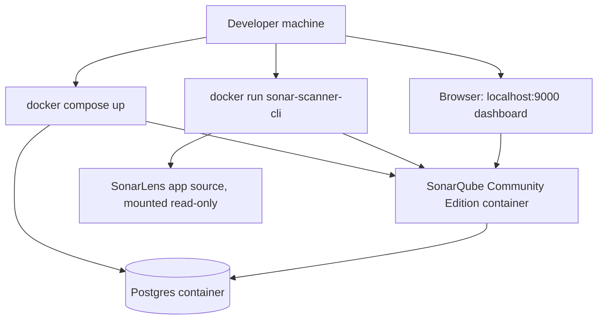
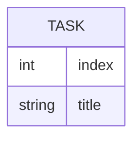

# SonarLens — Architecture

> Status: Draft | Last updated: 2026-09-18

## 1. System Overview
SonarLens has two halves that run side by side in Docker. The first half is the demo application itself: a small Flask task manager whose source is deliberately seeded with one representative issue from each SonarQube category. The second half is the analysis stack: a self-hosted SonarQube Community Edition server backed by Postgres, plus a one-off scanner container that reads the demo app's source and pushes findings into that server. Nothing in the analysis stack talks to any service outside the local Docker network.

## 2. Architecture Diagram

## 3. Tech Stack
| Layer | Technology | Rationale |
|---|---|---|
| Demo application | Python 3.12, Flask | Small, readable, easy to seed issues in without hidden framework magic |
| Analysis server | SonarQube Community Edition (Docker image `sonarqube:community`) | Free, self-hosted, covers all five issue categories across Python |
| Analysis database | PostgreSQL 15 | Required backing store for SonarQube, run as its own container |
| Scanner | `sonarsource/sonar-scanner-cli` Docker image | Official scanner, no local install needed, talks to the server over HTTP |
| Orchestration | Docker Compose | Brings up server + database together with one command |

## 4. Component Breakdown

### 4.1 SonarLens app (`app/`)
- Responsibility: Provide a small, runnable task manager and host the seeded issues.
- Interfaces: HTTP endpoints (`/health`, `/tasks`), plus the Python modules themselves as the actual analysis target.
- Depends on: Flask only, to keep the surface area small.

### 4.2 Seed modules
- Responsibility: Each file is scoped to exactly one SonarQube category (`bugs.py`, `vulnerabilities.py`, `hotspots.py`, `smells.py`, `duplication.py`), so a scan result can be traced back to a single, clearly commented source file.
- Interfaces: Plain Python functions imported into `main.py` so the app remains one coherent, runnable program rather than disconnected snippets.
- Depends on: Nothing beyond the standard library and Flask.

### 4.3 SonarQube server (Docker)
- Responsibility: Store analysis results and serve the web dashboard.
- Interfaces: Web UI and API on port 9000; JDBC connection to Postgres.
- Depends on: Postgres container being up first.

### 4.4 Scanner (Docker, one-off)
- Responsibility: Read the local source tree, run static analysis, and push results to the SonarQube server.
- Interfaces: Reads `sonar-project.properties`, mounts the repo, talks to the server over `SONAR_HOST_URL`.
- Depends on: A running SonarQube server and a valid project token.

## 5. Data Model
SonarLens's own data model is intentionally trivial, since the app exists to host seeded issues rather than to manage real data.

SonarQube's own findings data (issues, hotspots, measures) lives inside its Postgres container and is not modeled here, since it is owned entirely by the SonarQube server component.

## 6. API Design
| Method | Endpoint | Purpose | Auth required |
|---|---|---|---|
| GET | /health | Basic liveness check, also exposes current debug flag state (a seeded hotspot) | No |
| GET | /tasks | List all tasks currently held in memory | No |
| POST | /tasks | Add a new task | No |
| GET | /tasks/<idx> | Get a single task by index (contains a seeded off-by-one bug) | No |

## 7. Infrastructure & Deployment
- Local only: `docker compose up -d` starts the SonarQube server and its database.
- Analysis is triggered manually via a single `docker run` command against `sonarsource/sonar-scanner-cli`.
- No staging or production environment is defined; this is a local demonstration tool, not a deployed service.
- CI/CD wiring is explicitly out of scope for the current phases (see Phases document, Future section).

## 8. Security Considerations
- The demo app itself has no authentication, since it is not meant to hold real data or be exposed beyond localhost.
- The seeded vulnerabilities (command injection, weak hashing, SQL string concatenation, disabled certificate verification, hardcoded secret) are intentional and must stay clearly labeled as demo-only in both code comments and README, so the repository is never mistaken for a real application.
- SonarQube's own admin credentials should be changed from the default on first login, even in a local-only demo, as good practice.

## 9. Scalability & Performance
Not a concern for this project. The demo app handles a trivial number of requests, and the analysis stack is scoped to a single small codebase, so no scaling strategy is required.

## 10. Key Technical Decisions & Tradeoffs
| Decision | Alternatives considered | Why this choice |
|---|---|---|
| Self-hosted SonarQube Community Edition via Docker | SonarCloud | Explicit requirement to avoid SonarCloud and keep everything local and offline |
| One seed file per issue category, wired into a single app | Five unrelated standalone scripts | Keeps the demo feeling like one real (if small) application rather than a pile of disconnected snippets, while still keeping each category isolated for explanation |
| Python/Flask stack | Node/Express, or multi-language demo | Python keeps the demo compact; SonarQube's Python analyzer alone is enough to cover all five categories, so multiple languages were not needed |

## 11. Open Technical Questions
- [ ] Should the scanner step be wrapped in a small shell script (`run-scan.sh`) to reduce it to a single command, or left as a raw `docker run` for transparency during a live demo?
- [ ] Should a second, remediated version of each seed file be added later to demonstrate a "before and after" scan?
