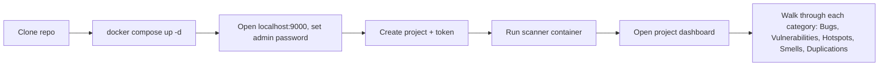

# SonarLens — Design Document

> Status: Draft | Last updated: 2026-09-18

## 1. Design Principles
- Clarity over cleverness: every seeded issue should be immediately understandable from a short code comment, with no need to explain hidden intent.
- One category, one file: never mix issue types within a single seed file, so a viewer can always trace a dashboard finding back to exactly one place.
- Demo-first, not production-first: the task manager's own UX is intentionally minimal, since the SonarQube dashboard is the real "interface" being showcased.
- No decoration: strictly plain, text-based output and documentation, with no emojis or stylistic flourishes anywhere in code, comments, or docs.

## 2. User Flows

### 2.1 Running the demo end to end

Narrative walkthrough: the presenter starts the SonarQube server and database with one command, waits for the server to become reachable, logs into the web UI to set a real password and create a project token, runs the scanner container once against the mounted source, then opens the resulting dashboard and walks through each of the five categories, pointing at the specific seed file responsible for each.

## 3. Key Screens / Views
SonarLens itself has no real user interface beyond a few JSON endpoints; the meaningful "screen" in this project is the SonarQube dashboard, which is owned by SonarQube rather than by this project.

### 3.1 SonarQube project dashboard (external, not built by this project)
- Purpose: Show the five issue categories and their counts after a scan.
- Key elements: Bugs, Vulnerabilities, Security Hotspots, Code Smells, and Duplications widgets, plus a file-level drill-down.
- States: empty state — before the first scan, the dashboard shows no measures; populated — after a successful scan, all five categories show at least one finding; error state — if the scanner fails to reach the server, the dashboard remains in its previous state and the scanner container prints a connection error to the console.

### 3.2 SonarLens task manager (minimal, this project's own code)
- Purpose: Provide a small, real running application for the scanner to analyze; not meant to be demoed as an app in its own right.
- Key elements: `/health`, `/tasks` (GET and POST), `/tasks/<idx>` (GET).
- States: empty state — no tasks added yet, `/tasks` returns an empty list; populated — tasks list grows as items are added; error — the seeded off-by-one bug in `get_item` can return `None` or raise an index error depending on the index requested, which is itself part of the demo.

## 4. Component Library / Style Guide
Not applicable in the traditional sense, since SonarLens has no visual front end. The only style rule that matters here is documentation and code style: plain markdown, plain code comments, and strictly no emojis anywhere in the project.

## 5. Interaction Patterns
Not applicable; SonarLens is interacted with entirely through the command line (Docker commands) and the SonarQube web dashboard, which is out of this project's control.

## 6. Accessibility
Not applicable; there is no custom user interface in this project. The only interface a user directly reads is markdown documentation, which should remain plain, well-structured, and readable in any standard markdown viewer.

## 7. Responsive / Platform Behavior
Not applicable; this is a local, Docker-based command-line and API demo, not a rendered UI with breakpoints.

## 8. Edge Cases & Error States
- Edge case: requesting `/tasks/<idx>` with an out-of-range index → handled by the seeded off-by-one bug, which is intentional and documented rather than fixed, since demonstrating the bug is the point.
- Edge case: SonarQube server not yet fully started when the scanner runs → handled by documenting an expected wait time in the README before running the scan.
- Error state: scanner container cannot reach `SONAR_HOST_URL` → the scan fails with a clear connection error in the console; no partial or corrupted dashboard state results, since SonarQube does not commit incomplete analyses.

## 9. Open Design Questions
- [ ] Should the README include annotated screenshots of the dashboard for each category, or should it stay text-only to keep the repository fully self-contained without binary assets?
